# ii-taller-git-2026

- **Nombre:** Irina Insfrán
- **GitHub:** [IrinaInsfran](https://github.com/IrinaInsfran)
- **Materia:** Lenguaje de Programacion 3
- **Seccion:** F
- **Licencia:** [Apache License 2.0](LICENSE)
- **Commit de la solución:** _pendiente: se completa con el enlace al commit del merge a `main`_
- **Bitácora de uso de IA:** [BITACORA.md](BITACORA.md)

API REST en Spring Boot 4 / Java 21 sobre el dominio de Minecraft (POO).
El dominio no depende de Spring: vive en `py.edu.uc.lp3.minecraft` y la capa web
en `py.edu.uc.lp3.web`. Los servicios (`service`, `service.impl`) siguen el
template de la cátedra; el dominio y la capa web llevan los nombres que pide la
consigna 1 del enunciado POO-06 (`minecraft` separado de `web`).

## Cómo levantar

```bash
./mvnw spring-boot:run
```

Queda escuchando en `http://localhost:8080`. Para correr solo los tests:

```bash
./mvnw clean test
```

## Endpoints

### `GET /`

```bash
curl "http://localhost:8080/"
```

```json
{"autora":"Irina","dominio":"Minecraft","estado":"API funcionando"}
```

### `GET /api/minecraft/creeper`

Crea un creeper con todos los parámetros del juego.

```bash
curl "http://localhost:8080/api/minecraft/creeper?salud=20&x=6&y=64&z=0&velocidad=2&rangoDeteccion=16&danoAtaque=3&tiempoExplosion=30"
```

```json
{
  "salud": 20,
  "saludMaxima": 20,
  "posicionX": 6.0,
  "posicionY": 64.0,
  "posicionZ": 0.0,
  "velocidad": 2,
  "rangoDeteccion": 16.0,
  "danoAtaque": 3,
  "tiempoExplosion": 30
}
```

Si un valor viola una regla del dominio, la respuesta es `400`. El controller no
valida nada: la regla vive en la clase y el `@RestControllerAdvice` solo la
traduce a JSON.

```bash
curl "http://localhost:8080/api/minecraft/creeper?salud=0&x=6&y=64&z=0&velocidad=2&rangoDeteccion=16&danoAtaque=3&tiempoExplosion=30"
```

```json
{
  "error": "argumento_invalido",
  "mensaje": "La salud debe ser mayor que cero."
}
```

### `GET /api/minecraft/creeper/por-posicion`

Usa el constructor sobrecargado `Creeper(x, y, z)`, que completa con los valores
por defecto (salud 20, velocidad 1, rango 16, daño 3, tiempo de explosión 30).

```bash
curl "http://localhost:8080/api/minecraft/creeper/por-posicion?x=10&y=64&z=-5"
```

```json
{
  "salud": 20,
  "saludMaxima": 20,
  "posicionX": 10.0,
  "posicionY": 64.0,
  "posicionZ": -5.0,
  "velocidad": 1,
  "rangoDeteccion": 16.0,
  "danoAtaque": 3,
  "tiempoExplosion": 30
}
```

### `GET /api/minecraft/comportamientos`

Un ítem por clase concreta, resuelto por polimorfismo.

```bash
curl "http://localhost:8080/api/minecraft/comportamientos"
```

```json
[
  {
    "tipo": "Creeper",
    "comportamiento": "Se aproxima a su objetivo y explota después de su tiempo de detonación."
  },
  {
    "tipo": "Aldeano",
    "comportamiento": "Puede comerciar según su profesión y huir de las amenazas."
  },
  {
    "tipo": "Zombie",
    "comportamiento": "Persigue al jugador dentro de su rango e infecta a los aldeanos."
  }
]
```

## Diagrama de clases

Todas las clases del diagrama están en el paquete `py.edu.uc.lp3.minecraft`.
Los métodos marcados con `*` son abstractos.

```mermaid
classDiagram
    class Entidad {
        <<abstract>>
        -int salud
        -int saludMaxima
        -double posicionX
        -double posicionY
        -double posicionZ
        -int velocidad
        +Entidad(int salud, double posicionX, double posicionY, double posicionZ, int velocidad)
        +mover(double dx, double dz)
        +mover(double dx, double dy, double dz)
        +distanciaA(Entidad otra) double
        +recibirDano(int cantidad)
        +curar(int cantidad)
        #morir()
        +estaViva() boolean
        +getSalud() int
        +getSaludMaxima() int
        +getPosicionX() double
        +getPosicionY() double
        +getPosicionZ() double
        +getVelocidad() int
        +describirComportamiento()* String
    }

    class EntidadHostil {
        <<abstract>>
        -double rangoDeteccion
        -int danoAtaque
        +EntidadHostil(int salud, double posicionX, double posicionY, double posicionZ, int velocidad, double rangoDeteccion, int danoAtaque)
        +atacar(Entidad objetivo)
        +getRangoDeteccion() double
        +getDanoAtaque() int
        +describirComportamiento()* String
    }

    class EntidadPasiva {
        <<abstract>>
        -boolean domesticable
        +EntidadPasiva(int salud, double posicionX, double posicionY, double posicionZ, int velocidad, boolean domesticable)
        +huir(Entidad amenaza)
        +isDomesticable() boolean
        +describirComportamiento()* String
    }

    class Jugador {
        -String nombre
        -int nivelEXP
        +Jugador(int salud, double posicionX, double posicionY, double posicionZ, int velocidad, String nombre, int nivelEXP)
        +construir()
        +craftear()
        +interactuar()
        +ganarExperiencia(int cantidad)
        +getNombre() String
        +getNivelEXP() int
        +describirComportamiento() String
    }

    class Creeper {
        -int tiempoExplosion
        +Creeper(double posicionX, double posicionY, double posicionZ)
        +Creeper(int salud, double posicionX, double posicionY, double posicionZ, int velocidad, double rangoDeteccion, int danoAtaque, int tiempoExplosion)
        +atacar(Entidad objetivo)
        +explotar()
        +getTiempoExplosion() int
        +describirComportamiento() String
    }

    class Zombie {
        +Zombie(int salud, double posicionX, double posicionY, double posicionZ, int velocidad, double rangoDeteccion, int danoAtaque)
        +infectaAldeano(Aldeano aldeano)
        +describirComportamiento() String
    }

    class Esqueleto {
        +Esqueleto(int salud, double posicionX, double posicionY, double posicionZ, int velocidad, double rangoDeteccion, int danoAtaque)
        +dispararFlecha()
        +describirComportamiento() String
    }

    class Aldeano {
        -String profesion
        -boolean infectado
        +Aldeano(int salud, double posicionX, double posicionY, double posicionZ, int velocidad, boolean domesticable, String profesion)
        +comercio()
        ~infectar()
        +isInfectado() boolean
        +getProfesion() String
        +describirComportamiento() String
    }

    class Animal {
        -boolean montable
        +Animal(int salud, double posicionX, double posicionY, double posicionZ, int velocidad, boolean domesticable, boolean montable)
        +montar(Jugador jugador)
        +isMontable() boolean
        +isMontar() boolean
        +describirComportamiento() String
    }

    Entidad <|-- EntidadHostil
    Entidad <|-- EntidadPasiva
    Entidad <|-- Jugador

    EntidadHostil <|-- Creeper
    EntidadHostil <|-- Zombie
    EntidadHostil <|-- Esqueleto

    EntidadPasiva <|-- Aldeano
    EntidadPasiva <|-- Animal
```



## Sobrecarga y sobreescritura: qué cambió

### Sobrecarga (misma acción, otra lista de argumentos)

| Antes | Ahora | Por qué |
|---|---|---|
| `Creeper` tenía un solo constructor de 8 parámetros. | Se suma `Creeper(x, y, z)`, que usa los valores por defecto del juego (salud 20, velocidad 1, rango 16, daño 3, explosión 30) y delega con `this(...)` en el constructor completo. | Crear un creeper "normal" solo con su posición, sin duplicar validaciones: las dos firmas dejan el objeto en un estado legal. Se expone en `GET /api/minecraft/creeper/por-posicion`. |
| `mover()` sin argumentos solo imprimía un texto y no cambiaba el estado. | Se elimina y se agrega `mover(dx, dz)`, que desplaza en el plano horizontal y delega en `mover(dx, dy, dz)`. | Una sobrecarga tiene que hacer la misma acción con otro contexto, no un mensaje vacío. Las dos firmas respetan el tope de velocidad. |

### Sobreescritura (la clase hija responde a su manera)

| Antes | Ahora | Por qué |
|---|---|---|
| `EntidadHostil` y `EntidadPasiva` eran instanciables y devolvían una descripción genérica de `describirComportamiento()`. | Son abstractas y redeclaran `describirComportamiento()` como abstracto; lo implementan con `@Override` `Jugador`, `Creeper`, `Zombie`, `Esqueleto`, `Aldeano` y `Animal`. | No existe un "hostil genérico" en el juego: cada tipo concreto debe saber describirse. |
| El `ComportamientoController` creaba y describía dos entidades sueltas. | El controller delega en `ComportamientoServiceImpl`, que recorre un `List<Entidad>` (`Creeper`, `Aldeano`, `Zombie`) y llama a `describirComportamiento()` sin `if`, `switch` ni `instanceof`. | La JVM elige la implementación de cada clase hija; agregar una entidad nueva no obliga a tocar el servicio. |
| — | `Creeper` sobreescribe `atacar(Entidad)`: llama a `super.atacar(objetivo)` y después `explotar()`. | Reutiliza las reglas del ataque hostil (objetivo vivo, dentro del rango) y agrega su propio efecto. |

## Qué quedó encapsulado

`Entidad` concentra lo que toda entidad del juego tiene en común: salud, posición
y velocidad, con sus invariantes garantizados en el constructor y en los métodos
que la modifican. Por eso `curar` nunca deja la salud negativa ni por encima de
la máxima (compara contra el faltante en lugar de sumar y desbordar) y
`ganarExperiencia` usa `Math.addExact` para rechazar el desbordamiento en lugar
de dar la vuelta. `EntidadHostil` y `EntidadPasiva` son abstractas: no existe un
"hostil genérico" en el juego, así que cada clase concreta (`Creeper`, `Zombie`,
`Esqueleto`, `Aldeano`, `Animal`, `Jugador`) debe describir su propio
comportamiento. Los datos de la construcción quedan privados detrás de getters:
`Creeper` expone su `tiempoExplosion` sin permitir que nadie lo cambie después,
y el `infectar()` de `Aldeano` es de alcance de paquete para que solo `Zombie`
pueda ejecutarlo, sin setter público. Finalmente, el controller no repite ninguna
de estas reglas: solo construye la entidad y deja que el dominio decida; si algo
se viola, el `@RestControllerAdvice` traduce la excepción a un 400 con el mensaje
que lanzó la clase.
